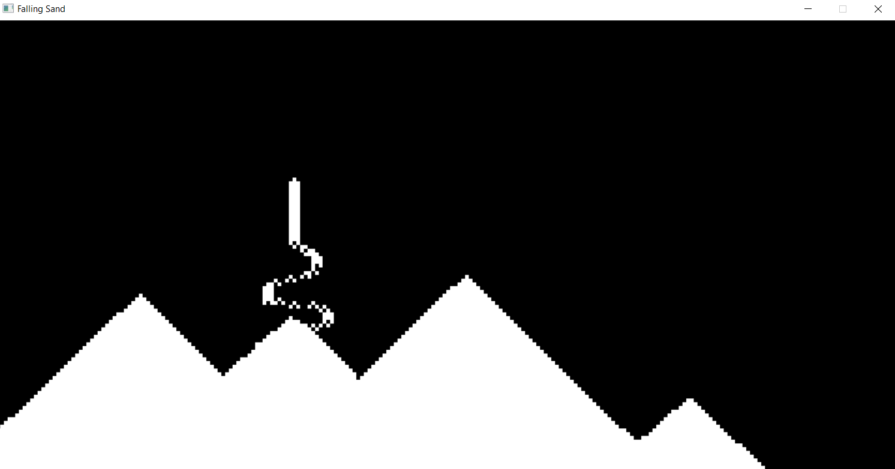

# Black and White Falling Sand Simulator

This project is a minimalist falling sand simulator built with C++ and SDL, designed and developed in Visual Studio.
The simulation allows for the creation of dynamic 2D sand 
dunes that form as sand particles fall from the cursor's position when a mouse button is pressed.
The simplicity of black and white graphics focuses the attention on the mesmerizing patterns of falling sand.

## Features

- **Dynamic Sand Simulation**: Click and hold a mouse button to release sand particles that fall and simulate natural dune formation.
- **Particle Physics**: Each sand particle behaves according to simplified physics rules, falling until it reaches an obstacle, whether the ground or another particle.
- **Randomized Particle Movement**: Once a falling sand particle encounters a pile, it decides randomly whether to move left or right, creating natural-looking dunes.
- **SDL for Rendering**: Utilizes the Simple DirectMedia Layer (SDL) library for efficient graphical rendering and mouse input handling.

## Getting Started

To run the Falling Sand Simulator on your machine, follow these steps. Ensure that you have Visual Studio and SDL set up correctly for C++ projects.

## Screenshots

